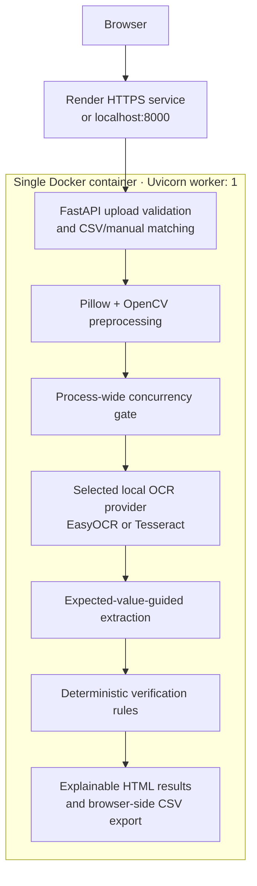

# TTB Alcohol Label Pre-Screener

TTB Alcohol Label Pre-Screener is a deployable proof of concept that compares alcohol beverage label artwork against expected application data. It uses selectable local OCR engines and deterministic validation rules to return explainable PASS, FAIL, or NEEDS REVIEW results for each label field. The prototype requires no API keys, hosted AI service, or database, and it does not persist uploaded label data.

> This is a decision-support prototype, not a COLA approval system or legal determination.

The original take-home prompt is preserved in [`instructions/README.md`](instructions/README.md).

## Live Demo

**Live app:** [https://treasury-take-home-4wq7.onrender.com/](https://treasury-take-home-4wq7.onrender.com/)

No account, API key, or environment setup is required. If the service has been idle, the first page load may take longer while Render starts the container.

### How to use the live app

1. **Open the live app.** Use the Render link above and wait for **Start A Label Review** to appear.
2. **Add label artwork.** Drag JPEG or PNG files onto **Drop Label Images Here**, or choose **Browse Files**. Multiple files can be selected together or added in several selections. Each image must have a unique filename.
3. **Confirm the selection.** Review the thumbnails, filenames, and total upload size. Remove an incorrect image with its remove button before continuing.
4. **Choose how to enter application data:**
   - **Enter Manually:** use this for one or a few labels. For every filename, select the alcohol label type and enter the expected brand name, class/type, alcohol content, net contents, and bottler/producer name and address. Enter any applicable beverage-specific fields. For an imported product, select **Imported product** and enter the country of origin.
   - **Upload Batch CSV:** use this for larger batches. Select a UTF-8 CSV containing one row per image. Each `file_name` must match its uploaded image filename; matching is case-insensitive but otherwise exact. The required and optional columns are documented in [CSV Batch Format](#csv-batch-format), and the live app provides a [downloadable template](https://treasury-take-home-4wq7.onrender.com/sample.csv).
5. **Start the review.** Choose **Verify Labels** once. Keep the tab open while OCR and validation run; larger Tesseract batches on Render may take several minutes.
6. **Read the summary.** Use the Total, PASS, FAIL, and NEEDS REVIEW buttons to filter the result cards:
   - **PASS:** all required automated checks passed against the entered application data.
   - **FAIL:** at least one required field has a material mismatch or was not detected.
   - **NEEDS REVIEW:** OCR confidence or a validation rule was inconclusive.
7. **Inspect the evidence.** Expand each card to compare expected and detected values, rationale, requirement basis, and TTB source. Open the larger image preview or **View Extracted OCR Text** when a finding needs investigation.
8. **Record a human decision when needed.** Under **Final Result**, a reviewer can select PASS, NEEDS REVIEW, or FAIL. This changes the final image-level result but preserves all field findings and the original automated result.
9. **Export or start over.** Choose **Export Results** to download the CSV, or **Start Another Review** to return to the upload page. Results and overrides are not stored server-side, so export before closing or reloading the page.

For the repository’s complete evaluation batch, see [Test the Render demo with all 50 labels](#test-the-render-demo-with-all-50-labels).

## Interface

Start a review by adding JPEG or PNG label artwork and entering application data manually or by CSV.


Results summarize the batch and explain each field-level decision. Reviewers can filter outcomes, inspect OCR evidence, record an image-level override, and export CSV results.


## Quick Start

### Prerequisites

- Docker Desktop for the recommended container setup, or Python 3.11 for native setup.
- Internet access during installation or Docker build. The running container does not download models or call a hosted OCR service.
- Enough local disk space for PyTorch, both OCR engines, and the EasyOCR model weights.

### Docker

Docker is the recommended and most reproducible path. The image pins CPU-only PyTorch, installs Tesseract, and downloads the English EasyOCR weights during the build.

```bash
docker build -t ttb-label-pre-screener .
docker run --rm -p 8000:8000 ttb-label-pre-screener
```

The default container uses EasyOCR. To use the lighter Tesseract provider locally instead:

```bash
docker run --rm -p 8000:8000 -e OCR_ENGINE=tesseract ttb-label-pre-screener
```

Open [http://localhost:8000](http://localhost:8000). Verify startup at [http://localhost:8000/healthz](http://localhost:8000/healthz); the response reports the selected OCR engine and readiness.

### Native Python

Native setup defaults to EasyOCR. Its first startup downloads the English model to the local EasyOCR cache, so that first run requires internet access. Later runs use the cached model. Neither OCR engine requires an API key.

#### Windows PowerShell

```powershell
py -3.11 -m venv .venv
.\.venv\Scripts\Activate.ps1
python -m pip install --upgrade pip
python -m pip install torch==2.3.1 torchvision==0.18.1 --index-url https://download.pytorch.org/whl/cpu
python -m pip install -r requirements.txt
python -m uvicorn app.main:app --reload
```

If the `py` launcher is unavailable but Python 3.11 is on `PATH`, replace `py -3.11` with `python`.

#### macOS

```bash
python3.11 -m venv .venv
source .venv/bin/activate
python -m pip install --upgrade pip
python -m pip install torch==2.3.1 torchvision==0.18.1
python -m pip install -r requirements.txt
python -m uvicorn app.main:app --reload
```

#### Ubuntu/Debian Linux

Install the runtime libraries used by the Docker image, then create the environment:

```bash
sudo apt-get update
sudo apt-get install -y python3.11-venv libgl1 libglib2.0-0 libgomp1
python3.11 -m venv .venv
source .venv/bin/activate
python -m pip install --upgrade pip
python -m pip install torch==2.3.1 torchvision==0.18.1 --index-url https://download.pytorch.org/whl/cpu
python -m pip install -r requirements.txt
python -m uvicorn app.main:app --reload
```

#### Optional native Tesseract

To select Tesseract, first install the `tesseract` executable and confirm `tesseract --version` works in the same terminal:

- Windows: install Tesseract OCR and add its installation directory to `PATH`.
- macOS with Homebrew: `brew install tesseract`.
- Ubuntu/Debian: `sudo apt-get install -y tesseract-ocr`.

Then start the application with the engine override:

```powershell
# Windows PowerShell
$env:OCR_ENGINE = "tesseract"
python -m uvicorn app.main:app --reload
```

```bash
# macOS/Linux
OCR_ENGINE=tesseract python -m uvicorn app.main:app --reload
```

No environment variables are required. Optional deployment tuning is documented below.

## What It Does

| Area | Behavior |
| --- | --- |
| Uploads | Accepts validated JPEG/PNG batches (configurable to 300), prevents duplicate filenames, and matches each image to manual or CSV application data. |
| OCR | Selects EasyOCR or Tesseract, resizes RGB inputs, gates concurrency across all requests, and sends weak/unreadable text to NEEDS REVIEW. A second enhanced pass is optional and off by default. |
| Verification | Fuzzy-matches identity fields, parses alcohol/proof and equivalent volumes, strictly evaluates the Government Health Warning, and checks supplied beverage-specific fields. |
| Results | Explains every field with expected/detected text, rationale, requirement basis, and TTB source; supports filtering, overrides, image inspection, and CSV export. |
| Data handling | Keeps uploads and results in request/browser memory. It uses no database, hosted inference endpoint, runtime API key, or persistent upload storage. |

## Architecture



Render belongs in the diagram as the hosted deployment boundary, not as an application component. Local Docker and Render run the same container and single Uvicorn process.

The selected OCR provider is initialized once per process under a lock. EasyOCR reuses one reader; Tesseract reuses the installed binary. A process-wide executor and semaphore cap OCR across all simultaneous requests. The application default is two OCR jobs; `render.yaml` explicitly lowers this to one for predictable memory use on a small hosted instance.

Images are decoded, converted to owned RGB buffers, and resized before OCR. The optional second OCR pass creates extra grayscale/OpenCV buffers only when enabled. Request-scoped logs record an ID, numbered stages, timings, current and peak RSS, cleanup, export construction, and template rendering. Traces contain metadata only—not images, previews, OCR text, or arrays.

Batch verification remains one synchronous HTTP request. Gated concurrency helps small and moderate batches, but 200–300 image production jobs need a durable queue, controlled workers, progress updates, retries, and resumable results.

Core stack: Python 3.11, FastAPI, Uvicorn, Jinja2, local Bootstrap 5.3, EasyOCR, Tesseract/pytesseract, CPU-only PyTorch in Docker, OpenCV, Pillow, RapidFuzz, Pydantic, and Pytest.

## Why Local OCR

Local OCR keeps evaluator setup predictable and avoids hosted inference, API keys, and per-request model cost. Deterministic Python rules make each status traceable. Docker embeds the English EasyOCR weights and Tesseract language data; this enlarges the image and build time but removes runtime model downloads. These model files are application assets—uploaded labels are not persisted.

### Cost/benefit: local OCR versus a vision LLM

Neither approach is universally better. They solve different parts of the document-review problem.

| Consideration | Local OCR (Tesseract/EasyOCR) | Vision-language model | POC decision |
| --- | --- | --- | --- |
| Primary strength | Fast, inexpensive literal text extraction | Contextual interpretation of messy or unusual layouts | Use OCR for the common path |
| Difficult images | Can lose text under blur, glare, damage, handwriting, or unconventional placement | Can infer obscured text from visual and language context | Escalate uncertain OCR instead of guessing |
| Output | Raw text and confidence blocks; application code must structure them | Can return JSON, tables, or explanations directly | Deterministic parsers provide the required structure |
| Latency | Usually lower and predictable on local CPU | Usually slower because each image requires model inference | Keep batch evaluation responsive and bounded |
| Cost | Open-source runtime with no per-request fee | Token/image billing or the cost of hosting a large local model | Avoid recurring inference cost for routine labels |
| Data handling | Runs inside the container without sending labels to another service | Hosted use may transmit label data to a third party | Keep prototype uploads local to the deployed service |
| Auditability | Literal OCR evidence plus explicit, repeatable rules | Outputs may vary and can infer or hallucinate missing content | Keep statutory decisions rule-based and reviewable |

Local OCR is therefore the better baseline for this take-home: most expected labels can be processed more cheaply and quickly, with less infrastructure and a clearer evidence trail. The tradeoff is weaker interpretation of damaged or unusually photographed labels, which is why uncertainty becomes NEEDS REVIEW rather than an invented match.

## OCR Engine Selection

The app supports two local OCR engines:

- **EasyOCR** is the application default and is generally more tolerant of angled, blurred, decorative, or otherwise difficult label photos. Its detector is tuned for small label text and punctuation. A low-confidence result can trigger one whole-image 180° retry for an upside-down label.
- **Tesseract** uses less memory and starts faster on small CPU instances. Its preprocessing includes sparse-text segmentation, contrast normalization, dark-image inversion, adaptive thresholding, sharpening, a white border, and conservative deskewing.

The deployed Render demo selects Tesseract because EasyOCR also loads PyTorch and a neural model, increasing cold-start time, CPU use, and peak memory. Tesseract is the safer hosted choice on a low-tier plan, although recognition may be worse on difficult artwork. This is a resource tradeoff, not a claim that Tesseract is more accurate.

Set `OCR_ENGINE=easyocr` locally or on a larger instance for the stronger difficult-image engine. The rotation retry is deliberately limited: testing every orientation for every detected text box was more accurate in a few cases but made difficult batches several times slower and increased resource pressure. Invalid engine values log a warning and fall back to EasyOCR. `/healthz`, result cards, and CSV exports report the selected engine.

Neither engine requires an API key, hosted OCR account, or network request at runtime.

## CSV Batch Format

The CSV must be UTF-8 and contain the required columns below. `beverage_type` is optional when it can be inferred from `product_type`.

```csv
file_name,beverage_type,brand_name,product_type,abv,net_contents,producer,country_of_origin
old_tom_front.png,distilled_spirits,Old Tom Distillery,Kentucky Straight Bourbon Whiskey,45,750 mL,"Old Tom Distillery, Louisville, KY",
casa_azul.png,distilled_spirits,Casa Azul,Tequila,40,750 mL,"Casa Azul Imports, Austin, TX",Mexico
```

- `file_name` matching is case-insensitive and otherwise exact.
- `abv` accepts a number such as `45` or a formatted value such as `45% ABV`.
- Leave `country_of_origin` blank for domestic products; a value marks the row as imported.
- Accepted `beverage_type` values are `beer_malt`, `wine`, and `distilled_spirits`.
- Optional category fields are `beer_special_disclosure`, `wine_appellation`, `wine_sulfite_declaration`, `spirits_age_statement`, and `spirits_commodity_statement`.
- Missing image rows return NEEDS REVIEW for the affected image. Invalid schemas, duplicates, and incomplete rows return a form-level error.
- Download a ready-to-edit example from `/sample.csv`.

The original build-plan column names remain accepted for backward compatibility.

## Decision Rules

### Flexible Fields

Brand, class/type, producer/address, country, and entered conditional statements use normalized fuzzy similarity. Case, punctuation, spacing, and complete token reordering do not cause an automatic failure, but missing expected words reduce the score.

### Structured Quantities

Alcohol and net contents are parsed as typed quantities rather than compared as raw strings. Equivalent values pass; numeric mismatches fail. An incomplete alcohol statement may need review.

### Beverage-Specific Fields

Selecting beer/malt beverage, wine, or distilled spirits reveals the relevant conditional fields. A supplied expected value is verified. A blank optional field is not treated as proof that the legal requirement is inapplicable.

### Government Health Warning

For beverages at or above 0.5% ABV, the checker validates the statutory wording, ordered similarity, required-word coverage, an all-caps `GOVERNMENT WARNING` heading, and warning-specific OCR confidence.

- PASS: the complete statutory warning matches exactly, including wording, punctuation, and capitalization; OCR line breaks and repeated whitespace are ignored.
- NEEDS REVIEW: the warning is not exact but at least 75% of its required words are present, or an exact match has low OCR confidence. Missing or non-uppercase heading text is called out for manual review but does not change this ≥75% result to FAIL.
- FAIL: the warning is missing or has less than 75% required-word coverage. A different failed field still keeps the overall label result at FAIL.

Physical typography—including minimum type size, bold heading, continuous-paragraph layout, and character density—cannot be established reliably without scale metadata and layout analysis. It appears as an informational NEEDS REVIEW row that does not lower an otherwise automated PASS.

### Overall Result

- FAIL if any required automated field fails.
- NEEDS REVIEW if no field fails but at least one required field is ambiguous.
- PASS only when all required automated fields pass.

## TTB References

- [Beer / Malt Beverage Labeling](https://www.ttb.gov/regulated-commodities/beverage-alcohol/beer/labeling)
- [Distilled Spirits Labeling](https://www.ttb.gov/regulated-commodities/beverage-alcohol/distilled-spirits/labeling)
- [Wine Labeling](https://www.ttb.gov/regulated-commodities/beverage-alcohol/wine/labeling)
- [Malt Beverage Health Warning](https://www.ttb.gov/regulated-commodities/beverage-alcohol/beer/labeling/malt-beverage-health-warning)
- [Distilled Spirits Health Warning](https://www.ttb.gov/regulated-commodities/beverage-alcohol/distilled-spirits/ds-labeling-home/ds-health-warning)
- [Wine Health Warning](https://www.ttb.gov/regulated-commodities/beverage-alcohol/wine/labeling-wine/wine-labeling-health-warning-statement)

See [`docs/rule_documentation.md`](docs/rule_documentation.md) for field-level implementation bases and source mapping.

## Render Deployment

`render.yaml` defines a Docker web service and `/healthz` check.

No environment variables are required for the prototype. Optional tuning variables are listed below.

| Variable | Default | Purpose |
| --- | ---: | --- |
| `OCR_ENGINE` | `easyocr` | Selects `easyocr` or `tesseract` |
| `OCR_MAX_WORKERS` | `2` | Limits concurrent OCR jobs across all requests |
| `LOG_LEVEL` | `INFO` | Logging level |
| `MAX_IMAGE_BYTES` | `12582912` | Per-image upload limit |
| `MAX_TOTAL_BYTES` | `104857600` | Total request upload limit |
| `MAX_IMAGES` | `300` | Max images per batch |
| `MAX_IMAGE_DIMENSION` | `3200` | Absolute preprocessing dimension cap |
| `MAX_OCR_IMAGE_DIMENSION` | `1600` | OCR long-edge resize target |
| `ENABLE_SECOND_OCR_PASS` | `false` | Enables the enhanced retry for weak OCR |
| `OCR_GPU` | `false` | Enables GPU OCR if available |
| `EASYOCR_ROTATION_RETRY` | `true` | Retries low-confidence EasyOCR labels after a 180° rotation |
| `EASYOCR_ROTATION_RETRY_THRESHOLD` | `0.45` | Confidence below which the rotation retry runs |
| `TESSERACT_PSM` | `11` | Sparse-text segmentation mode for label layouts |
| `TESSERACT_DESKEW` | `true` | Corrects detected skew up to 15 degrees |

`EASYOCR_MODEL_DIR` may also override the model location for a native deployment. Docker already sets it to the model directory embedded during the image build. `PYTHONUNBUFFERED=1` is set by the Dockerfile.

The Render blueprint overrides the application defaults with `OCR_ENGINE=tesseract`, `OCR_MAX_WORKERS=1`, and no second pass. This reduces cold-start pressure, peak memory, and concurrent inference risk. The settings are optional tuning values, not secrets.

1. Push the repository to GitHub.
2. In Render, choose **New → Blueprint**.
3. Connect the repository and apply `render.yaml`.
4. Wait for the image, OCR assets, and dependencies to build.
5. Confirm `/healthz` and open the service URL.

The deployed Render service is usable immediately after build. Evaluators do not need to provide API keys, configure storage, or set environment variables.

Docker and Render both use one Uvicorn worker (`--workers 1`). Tesseract is recommended on Render because it avoids loading EasyOCR/PyTorch into runtime memory. A Starter instance remains an operational recommendation rather than an application requirement. The service needs no secret, database, persistent disk, or runtime model download.

The same container can later be evaluated for Azure Container Apps or Azure App Service. Federal production deployment would still require agency review for identity, audit, retention, accessibility, and security controls.

## Testing

```bash
pip install -r requirements-test.txt
pytest
```

The fast suite covers rules, parsing, uploads, exports, OCR providers, concurrency, tracing, preprocessing, health checks, and deployment defaults. Three opt-in tests run the real Tesseract binary against generated fixtures.

```powershell
docker run --rm -e PYTHONPATH=/workspace -e RUN_TESSERACT_FIXTURE_TESTS=1 -e MAX_OCR_IMAGE_DIMENSION=1600 -e TESSERACT_PSM=11 -e TESSERACT_DESKEW=true -v "${PWD}:/workspace" -w /workspace --entrypoint python ttb-label-pre-screener:local tests/test_tesseract_fixture_quality.py
```

`tests/resources/sample_data/` contains 50 generated labels and one matching CSV. `batch_mixed.csv` covers all images. Dataset realism limits are documented below.

### Test the Render demo with all 50 labels

Download or clone this repository first; the test files are not hosted by the Render app.

From the repository root, use:

- Label folder: [`tests/resources/sample_data/labels/`](tests/resources/sample_data/labels/) — 50 PNG files
- Matching CSV: [`tests/resources/sample_data/csv/batch_mixed.csv`](tests/resources/sample_data/csv/batch_mixed.csv)

1. Open the [Render demo](https://treasury-take-home-4wq7.onrender.com/).
2. Under **Add Label Images**, select **Browse Files**.
3. Open `tests/resources/sample_data/labels/`, select all 50 PNG files (`Ctrl+A` on Windows/Linux or `Command+A` on macOS), and choose **Open**.
4. Confirm the page reports 50 selected images.
5. Under **Add Application Data**, choose **Upload Batch CSV**.
6. Select `tests/resources/sample_data/csv/batch_mixed.csv`.
7. Choose **Verify Labels** once and leave the tab open while the request runs.
8. On the results page, confirm **50 Total**, inspect the PASS/FAIL/NEEDS REVIEW filters, and use **Export Results** to download the output CSV.

Render uses one Tesseract OCR worker, so this full synchronous batch can take several minutes, especially after a cold start. Avoid refreshing or submitting the form twice. Outcome counts may vary as OCR changes; `batch_mixed.csv` supplies expected application values, not precomputed golden results.

### Intended outcome reference

The fixture-design baseline is **18 PASS, 5 FAIL, and 27 NEEDS REVIEW**. This is a reference for the scenarios represented by the images—not a guarantee that every OCR engine/version will produce identical observed counts. A clean fixture can move to NEEDS REVIEW when OCR confidence is poor, while severe image loss can produce FAIL when required evidence is absent.

<details>
<summary><strong>PASS — 18 labels</strong></summary>

- `atlas_gin_zoomed_out.png`
- `brickhouse_dirty.png`
- `casa_azul_tequila_import.png`
- `cloudline_motion_blur.png`
- `coastal_pilsner_perspective.png`
- `copper_fox_rotated_left.png`
- `curved_can_pale_ale.png`
- `granite_peak_shadow.png`
- `iron_hop_rotated_right.png`
- `laurel_ridge_wine.png`
- `lunar_rum_dirty.png`
- `mossy_bank_crumpled.png`
- `mudtrack_brown_ale.png`
- `old_tom_distillery.png`
- `orchard_lane_low_resolution.png`
- `pine_trail_beer.png`
- `stones_throw_case_variation.png`
- `wild_rose_water_stain.png`

</details>

<details>
<summary><strong>FAIL — 5 labels</strong></summary>

- `half_label_wheat_cropped.png` — statutory warning removed
- `hilltop_wrong_net_contents.png` — net contents mismatch
- `north_point_wrong_abv.png` — alcohol-content mismatch
- `red_ridge_missing_warning.png` — statutory warning missing
- `sol_y_mar_missing_country.png` — imported product missing country of origin

</details>

<details>
<summary><strong>NEEDS REVIEW — 27 labels</strong></summary>

- `bayview_skewed_angle.png`
- `black_anchor_cropped_side.png`
- `blue_door_vertical_text.png`
- `broken_compass_cropped_top.png`
- `canyon_echo_zoomed_in.png`
- `crooked_still_weird_layout.png`
- `cropped_warning_label.png`
- `ember_cask_torn_bourbon.png`
- `festival_lager_weird_layout.png`
- `frost_line_upside_down.png`
- `golden_hour_occluded.png`
- `jade_dragon_flipped.png`
- `midnight_vodka_blurry.png`
- `mirror_ipa_flipped.png`
- `neon_stag_glare.png`
- `night_jar_dark.png`
- `paper_crane_logo_heavy.png`
- `pixel_porter_low_resolution.png`
- `prairie_moon_glare.png`
- `riverbend_noisy.png`
- `sidecrop_amber.png`
- `silver_oak_low_contrast.png`
- `summit_brandy_perspective.png`
- `sunroom_overexposed.png`
- `tiny_ale_zoomed_out.png`
- `torn_ticket_saison.png`
- `upside_down_stout.png`

</details>

## Security and Data Handling

- Uploaded files and application data are read into memory for the active request and are not persisted by the application.
- Result previews are bounded JPEG data URLs returned in the HTML response and retained only in the browser page.
- OCR text and overrides are not stored server-side.
- Request traces retain only identifiers, timings, counts, dimensions, and memory measurements—not OCR text, images, previews, or arrays.
- The container includes application code, dependencies, EasyOCR weights, and Tesseract language data; those model files are not user data.
- Image type, decoded format, size, total request size, and pixel count are validated before OCR.
- No live COLA access, authentication, approval action, or external inference service is included.

## Assumptions and Tradeoffs

Manual or CSV values stand in for trusted COLA application data. PASS, FAIL, and NEEDS REVIEW are pre-screening outcomes; a human remains the decision-maker.

| Choice | Benefit | Cost / boundary |
| --- | --- | --- |
| Local OCR + deterministic rules | No API keys or per-request model cost; explainable outcomes | Less flexible than general document understanding |
| EasyOCR as the application default | Better tolerance for difficult photos | PyTorch increases image size, startup time, CPU, and memory |
| Tesseract on Render | Lower, more predictable hosted resource use | Lower accuracy on severe angles, blur, decoration, and curvature |
| Gated OCR concurrency | Prevents unbounded inference across simultaneous requests | Application default `2`; Render uses `1`, so batches may take longer |
| Embedded OCR assets | No runtime model download or hosted dependency | Larger Docker image and slower build |
| In-memory request processing | Simple deployment with no database or storage secrets | No durable job state, resume, server-side audit history, or recovery after restart |
| Expected-value-guided extraction | Strong evidence for field-by-field comparison | Depends on correct application data and is not open-ended label interpretation |
| Synchronous batch response | Simple evaluator workflow | Unsuitable for production-scale 200–300 image jobs without a queue |

## Known Limitations

| Limitation | Effect | Production direction |
| --- | --- | --- |
| Synchronous processing | Large or difficult batches may exceed an HTTP timeout; `MAX_IMAGES=300` is an acceptance limit, not a throughput guarantee | Durable queue, progress events, retries, cancellation, and resumable results |
| OCR image quality | Severe glare, curvature, decorative fonts, extreme skew, blur, mirroring, or crops can hide required text | Better capture guidance, layout-aware preprocessing, stronger OCR, and human review |
| Unscaled artwork | Physical type size, character density, and some layout requirements cannot be proven | Require scale metadata or source artwork and add layout measurement |
| Incomplete application context | Optional commodity rules are checked only when the expected field is supplied | Integrate trusted COLA data and expand rule coverage |
| No production controls | No login, role-based access, durable audit log, retention policy, monitoring, or live COLA integration | Complete agency security, privacy, accessibility, and operations review |

### Test-data limitation

The 50 generated labels deliberately vary beverage category, wording errors, damage, lighting, rotation, cropping, scale, mirroring, perspective, and layout. However, they come from one synthetic generator and reuse related fonts, drawing primitives, warning construction, image dimensions, and rendering assumptions. Some fixtures are therefore more visually similar and predictable than independently photographed labels.

The fixtures are useful for repeatable regression tests, not for claiming real-world accuracy. A production evaluation needs a larger, de-identified, human-reviewed corpus spanning printers, containers, materials, cameras, languages, typography, multi-panel artwork, natural backgrounds, and naturally occurring damage.

## Future Improvements

1. Add a durable queue with progress events, retries, cancellation, and resumable jobs for large batches.
2. Add authenticated COLA application lookup and role-based access.
3. Add structured audit events, retention controls, and deployment monitoring.
4. Expand layout-aware OCR for multi-panel labels and physical typography checks.
5. Add an AI-assisted second-review stage for OCR-generated FAIL and NEEDS REVIEW cases.
6. Calibrate field thresholds against a representative reviewed-label corpus.
7. Complete accessibility and agency security testing for the target hosting environment.

### Why AI is not in this POC

Local OCR and deterministic rules can handle the majority of expected labels faster and more cheaply, without per-request model cost or added infrastructure. Applying AI to every review would add credentials or a large local model, latency, operational and data-handling complexity, nondeterministic output, hallucination risk, and a separate accuracy/bias evaluation.

A production follow-up could use a hybrid second-review path:

1. Run local OCR and deterministic validation for every label.
2. Send only OCR-generated FAIL and NEEDS REVIEW cases to an agency-approved hosted or local vision model.
3. Ask the model for a schema-validated advisory response: likely text corrections, conflicting evidence, confidence, and an explanation tied to the image and expected application values.
4. Preserve the original OCR text and rule result alongside the AI suggestion.
5. Require a human to confirm any override; the model must not change statutory results or issue approval automatically.

This limits model cost and latency to exception cases while adding contextual interpretation where traditional OCR is weakest. A real implementation would also require confidence gates, redaction and retention controls, approved data residency, prompt/model version logs, accuracy and bias evaluation, and monitoring for hallucinated text.
