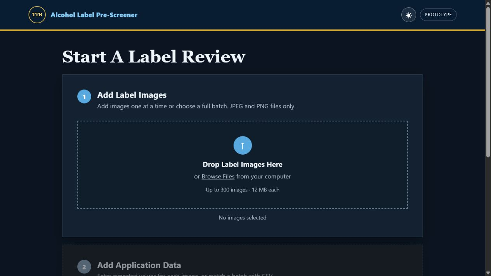
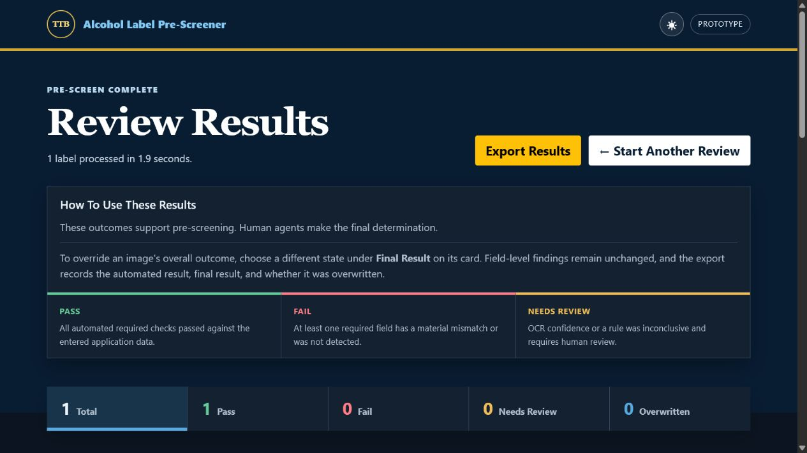

# TTB Alcohol Label Pre-Screener

TTB Alcohol Label Pre-Screener is a deployable proof of concept that compares alcohol beverage label artwork against expected application data. It uses local EasyOCR and deterministic validation rules to return explainable PASS, FAIL, or NEEDS REVIEW results for each label field. The prototype requires no API keys, hosted AI service, or database, and it does not persist uploaded label data.

> This is a decision-support prototype, not a COLA approval system or legal determination.

The original take-home prompt is preserved in [`instructions/README.md`](instructions/README.md).

## Live Demo

**Render URL:** [Add deployed service URL](https://your-render-service.onrender.com)

The repository is deployment-ready. A Render account owner must create the service to produce the public URL.

## Interface

Start a review by adding JPEG or PNG label artwork and entering application data manually or by CSV.



Results summarize the batch and explain every field-level decision. Agents can filter, inspect OCR text, override an image-level outcome, and export the review.



## Quick Start

### Docker

Docker is the most reproducible path because the image includes the English EasyOCR model weights.

```bash
docker build -t ttb-label-pre-screener .
docker run --rm -p 8000:8000 ttb-label-pre-screener
```

Open [http://localhost:8000](http://localhost:8000). The health endpoint is `/healthz`.

### Native Python

Use Python 3.11. The first native run downloads the English EasyOCR model; no API key is required.

```powershell
py -3.11 -m venv .venv
.\.venv\Scripts\Activate.ps1
python -m pip install --upgrade pip
pip install -r requirements.txt
uvicorn app.main:app --reload
```

On macOS or Linux, activate with `source .venv/bin/activate`.

No environment variables are required. Optional deployment tuning is documented below.

## What It Does

### Uploads

- Accepts JPEG and PNG artwork with a configurable batch limit, defaulting to 300 images.
- Supports additive selections, duplicate-name protection, removable thumbnails, and image previews.
- Validates extension, decoded format, file size, total request size, and pixel dimensions.
- Accepts one manual application form per filename or matching CSV rows.

### OCR

- Runs EasyOCR locally with one process-wide reader.
- Converts artwork to RGB and resizes every OCR input to a maximum 1600 px long edge by default.
- Can retry weak first passes with contrast-enhanced grayscale, but keeps that memory-intensive pass disabled by default.
- Supports batch uploads while processing images through a process-wide concurrency gate.
- Processes at most `OCR_MAX_WORKERS` images concurrently across all requests and preserves upload order in the results.
- Defaults to one OCR operation at a time for predictable memory usage on small cloud instances.
- Emits request-scoped stage, timing, cleanup, and RSS memory logs around preprocessing, OCR, parsing, export construction, and response rendering.
- Routes unreadable or low-confidence content to NEEDS REVIEW instead of inventing a match.

### Verification

- Fuzzy-matches identity fields while tolerating capitalization, punctuation, spacing, and harmless token reordering.
- Parses alcohol statements such as `45% ABV`, `45% Alc./Vol.`, and `90 Proof`.
- Converts equivalent volume statements such as `750 mL` and `0.75 liter`.
- Strictly checks Government Health Warning wording, heading capitalization, OCR confidence, and the 0.5% ABV applicability threshold.
- Checks entered wine, distilled-spirits, and beer/malt beverage conditional statements.

### Results

- Returns expected text, detected text, status, rationale, requirement basis, and an official TTB source for every field.
- Filters results by PASS, FAIL, NEEDS REVIEW, or overwritten status.
- Supports per-image overrides while preserving the automated finding.
- Exports application data, `original_result`, `final_result`, and `overwritten` to CSV.
- Includes collapsible details, a large image viewer, timing, dark mode, and navigation-loss warnings.

### Data Handling

- Keeps uploads, CSV rows, OCR text, and results in request/browser memory.
- Does not write uploaded label artwork or application data to persistent storage.
- Uses no database, hosted inference endpoint, or runtime API key.

## Architecture

```text
Browser (vendored Bootstrap + Jinja)
        |
        v
FastAPI validation --> manual data / CSV matching
        |
        v
Pillow + OpenCV preprocessing
        |
        v
Bounded executor --> process-wide EasyOCR reader
        |
        v
Expected-value-guided extraction
        |
        v
Deterministic verification rules
        |
        v
Explainable HTML results + CSV export
```

The process-wide EasyOCR reader is initialized once under a lock during startup; the same locked initializer is a safe lazy fallback and never creates a reader per image. A process-wide executor and reader-level semaphore bound concurrent inference to `OCR_MAX_WORKERS`, including work submitted by different users at the same time. The default is 1, so the shared reader processes one image at a time.

Every image is converted to an owned RGB buffer and reduced to `MAX_OCR_IMAGE_DIMENSION` before OCR. The contrast-enhanced retry and its additional grayscale/OpenCV buffers are created only when `ENABLE_SECOND_OCR_PASS=true`; the default is false for predictable memory use on small Render instances.

Each verification request receives an eight-character request ID. Structured INFO logs record numbered crash-isolation steps, stage timings, current RSS, peak observed RSS, cleanup, export-data construction, and template rendering. The trace stores metadata only—never image data, base64 previews, OCR text, or NumPy arrays.

Batch verification remains one synchronous HTTP request. Configurable gated concurrency supports small and moderate batches, but it does not turn 200–300 image reviews into a production job system. Production-scale batches need a durable background queue with controlled workers, progress updates, retries, and resumable results.

Core stack: Python 3.11, FastAPI, Uvicorn, Jinja2, local Bootstrap 5.3, EasyOCR, CPU-only PyTorch in Docker, OpenCV, Pillow, RapidFuzz, Pydantic, and Pytest.

## Why Local OCR

The stakeholder constraints favor explainability, predictable evaluator setup, and operation without hosted ML endpoints. EasyOCR therefore runs inside the application process, while explicit Python rules make every status traceable.

The Docker build downloads the English EasyOCR weights into `/app/.easyocr`. Embedding them increases image size and build time, but avoids model downloads, outbound inference calls, and model-endpoint failures during evaluator testing. Model files are part of the deployed application image; uploaded label files are not persisted.

## CSV Batch Format

The CSV must be UTF-8 and contain the required columns below. `beverage_type` is optional when it can be inferred from `product_type`.

```csv
file_name,beverage_type,brand_name,product_type,abv,net_contents,producer,country_of_origin
old_tom_front.png,distilled_spirits,Old Tom Distillery,Kentucky Straight Bourbon Whiskey,45,750 mL,"Old Tom Distillery, Louisville, KY",
casa_azul.png,distilled_spirits,Casa Azul,Tequila,40,750 mL,"Casa Azul Imports, Austin, TX",Mexico
```

- `file_name` matching is case-insensitive and otherwise exact.
- `abv` accepts a number such as `45` or a formatted value such as `45% ABV`.
- Leave `country_of_origin` blank for domestic products; a value marks the row as imported.
- Accepted `beverage_type` values are `beer_malt`, `wine`, and `distilled_spirits`.
- Optional category fields are `beer_special_disclosure`, `wine_appellation`, `wine_sulfite_declaration`, `spirits_age_statement`, and `spirits_commodity_statement`.
- Missing image rows return NEEDS REVIEW for the affected image. Invalid schemas, duplicates, and incomplete rows return a form-level error.
- Download a ready-to-edit example from `/sample.csv`.

The original build-plan column names remain accepted for backward compatibility.

## Decision Rules

### Flexible Fields

Brand, class/type, producer/address, country, and entered conditional statements use normalized fuzzy similarity. Case, punctuation, spacing, and complete token reordering do not cause an automatic failure, but missing expected words reduce the score.

### Structured Quantities

Alcohol and net contents are parsed as typed quantities rather than compared as raw strings. Equivalent values pass; numeric mismatches fail. An incomplete alcohol statement may need review.

### Beverage-Specific Fields

Selecting beer/malt beverage, wine, or distilled spirits reveals the relevant conditional fields. A supplied expected value is verified. A blank optional field is not treated as proof that the legal requirement is inapplicable.

### Government Health Warning

For beverages at or above 0.5% ABV, the checker validates the statutory wording, ordered similarity, required-word coverage, an all-caps `GOVERNMENT WARNING` heading, and warning-specific OCR confidence.

- PASS: near-exact wording and the all-caps heading are detected.
- NEEDS REVIEW: most wording is present, confidence is low, or capitalization/order is uncertain.
- FAIL: the warning is missing, materially incomplete, or substantially reworded.

Physical typography—including minimum type size, bold heading, continuous-paragraph layout, and character density—cannot be established reliably without scale metadata and layout analysis. It appears as an informational NEEDS REVIEW row that does not lower an otherwise automated PASS.

### Overall Result

- FAIL if any required automated field fails.
- NEEDS REVIEW if no field fails but at least one required field is ambiguous.
- PASS only when all required automated fields pass.

## TTB References

- [Beer / Malt Beverage Labeling](https://www.ttb.gov/regulated-commodities/beverage-alcohol/beer/labeling)
- [Distilled Spirits Labeling](https://www.ttb.gov/regulated-commodities/beverage-alcohol/distilled-spirits/labeling)
- [Wine Labeling](https://www.ttb.gov/regulated-commodities/beverage-alcohol/wine/labeling)
- [Malt Beverage Health Warning](https://www.ttb.gov/regulated-commodities/beverage-alcohol/beer/labeling/malt-beverage-health-warning)
- [Distilled Spirits Health Warning](https://www.ttb.gov/regulated-commodities/beverage-alcohol/distilled-spirits/ds-labeling-home/ds-health-warning)
- [Wine Health Warning](https://www.ttb.gov/regulated-commodities/beverage-alcohol/wine/labeling-wine/wine-labeling-health-warning-statement)

See [`docs/rule_documentation.md`](docs/rule_documentation.md) for field-level implementation bases and source mapping.

## Testing

```bash
pip install -r requirements-test.txt
pytest
```

The 44 automated tests cover normalization, reordered-token coverage, alcohol/proof and volume parsing, CSV and manual-data validation, strict warning behavior, category-specific rules, overall decisions, extraction edge cases, complete upload-to-results requests, browser-facing safeguards, exports, process-wide OCR gating, structured request tracing, memory-conscious preprocessing, health checks, and deployment defaults. HTTP tests disable model startup and inject deterministic OCR output, so the suite is fast and repeatable.

Twelve generated label images and three CSV batches live under `tests/resources/sample_data/`. They exercise passing labels, fuzzy matching, missing warnings and origin, numeric mismatches, low contrast, cropping, and skew.

## Render Deployment

`render.yaml` defines a Docker web service and `/healthz` check.

No environment variables are required for the prototype. Optional tuning variables are listed below.

| Variable | Default | Purpose |
| --- | ---: | --- |
| `OCR_MAX_WORKERS` | `1` | Limits concurrent OCR jobs |
| `LOG_LEVEL` | `INFO` | Logging level |
| `MAX_IMAGE_BYTES` | `12582912` | Per-image upload limit |
| `MAX_TOTAL_BYTES` | `104857600` | Total request upload limit |
| `MAX_IMAGES` | `300` | Max images per batch |
| `MAX_IMAGE_DIMENSION` | `3200` | Absolute preprocessing dimension cap |
| `MAX_OCR_IMAGE_DIMENSION` | `1600` | OCR long-edge resize target |
| `ENABLE_SECOND_OCR_PASS` | `false` | Enables the enhanced retry for weak OCR |
| `OCR_GPU` | `false` | Enables GPU OCR if available |

`EASYOCR_MODEL_DIR` may also override the model location for a native deployment. Docker already sets it to the model directory embedded during the image build. `PYTHONUNBUFFERED=1` is set by the Dockerfile.

The Render blueprint explicitly pins `OCR_MAX_WORKERS=1`, `MAX_OCR_IMAGE_DIMENSION=1600`, and `ENABLE_SECOND_OCR_PASS=false`. These are conservative optional settings, not required secrets; the same values are already application defaults.

1. Push the repository to GitHub.
2. In Render, choose **New → Blueprint**.
3. Connect the repository and apply `render.yaml`.
4. Wait for the image, dependencies, and EasyOCR model to build.
5. Confirm `/healthz`, then add the public URL to the Live Demo section.

The deployed Render service is usable immediately after build. Evaluators do not need to provide API keys, configure storage, or set environment variables.

Docker and Render both use one Uvicorn worker (`--workers 1`). A Render Starter instance is recommended because EasyOCR and PyTorch can exceed the memory available on smaller services; it is an operational recommendation, not an application requirement. The service needs no secret, database, persistent disk, or runtime model download.

The same container can later be evaluated for Azure Container Apps or Azure App Service. Federal production deployment would still require agency review for identity, audit, retention, accessibility, and security controls.

## Security and Data Handling

- Uploaded files and application data are read into memory for the active request and are not persisted by the application.
- Result previews are bounded JPEG data URLs returned in the HTML response and retained only in the browser page.
- OCR text and overrides are not stored server-side.
- Request traces retain only identifiers, timings, counts, dimensions, and memory measurements—not OCR text, images, previews, or arrays.
- The container includes application code, dependencies, and EasyOCR weights; those model files are not user data.
- Image type, decoded format, size, total request size, and pixel count are validated before OCR.
- No live COLA access, authentication, approval action, or external inference service is included.

## Assumptions and Tradeoffs

- Entered manual or CSV values stand in for trusted COLA application data.
- Deterministic rules favor auditability over broad generative interpretation.
- Expected-value-guided extraction works well for comparison but is not a general document-understanding system.
- One OCR worker, 1600 px inputs, and no enhanced retry are the safe defaults for predictable memory usage. Operators should load-test before raising these limits.
- PASS, FAIL, and NEEDS REVIEW are pre-screening outcomes; a human agent remains the decision-maker.

## Known Limitations

- Synchronous HTTP processing can time out on large or difficult batches.
- A 300-image configuration limit describes accepted batch size, not a production throughput guarantee.
- OCR remains sensitive to severe glare, curvature, decorative fonts, extreme skew, and partial crops.
- Physical type size and typography cannot be proven from an unscaled digital image.
- Conditional commodity rules are checked only when enough application context is supplied.
- There is no login, audit log, durable job state, database, or live COLA integration.

## Future Improvements

1. Add a durable queue with progress events, retries, cancellation, and resumable jobs for large batches.
2. Add authenticated COLA application lookup and role-based access.
3. Add structured audit events, retention controls, and deployment monitoring.
4. Expand layout-aware OCR for multi-panel labels and physical typography checks.
5. Calibrate field thresholds against a representative reviewed-label corpus.
6. Complete accessibility and agency security testing for the target hosting environment.
